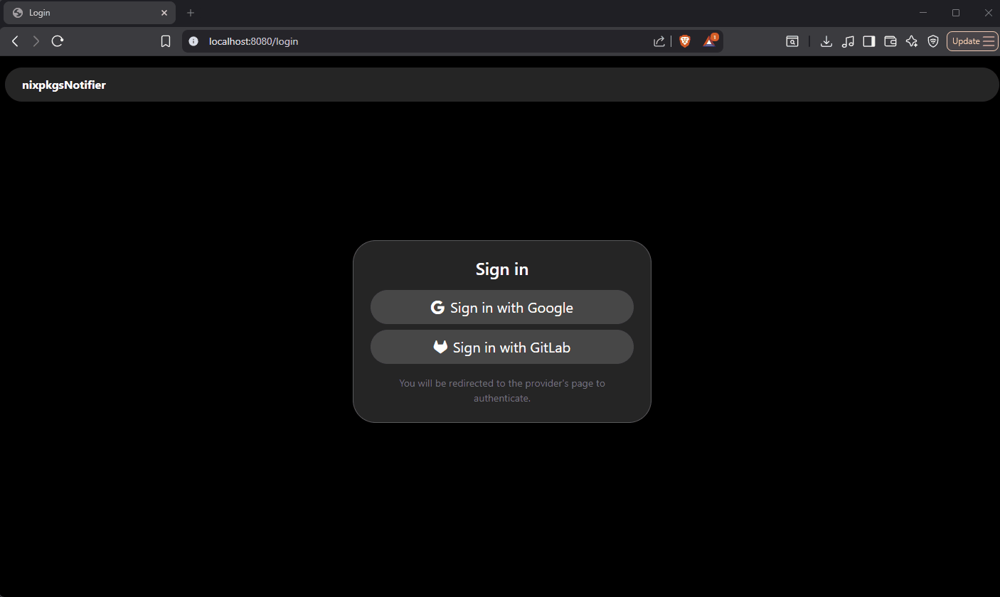

# nixpkgs-notifier
 
A web application that tracks Nixpkgs packages and sends notifications when a new version is detected. Users sign in via OIDC, subscribe to packages they care about, and receive notifications through email or webhook channels. Package versions are checked automatically on a configurable schedule, and users can also trigger a manual check at any time.



## Quick Start

1. **Prerequisites** - make sure you have Nix, PostgreSQL, OIDC provider, and an email provider ready (see [Requirements](#requirements)).
2. **Clone** the repo:
```bash
   $ git clone https://github.com/denyzzko/nixpkgs-notifier.git
```
3. **Copy** the example env file:
```bash
   $ cp .env.example .env
```
4. **Fill in `.env`** with your database credentials, OIDC provider and email settings (for more information see [Configuration](#configuration)).

5. **Register** the OIDC redirect URI with your identity provider:
```bash
   {SERVER_URL}/auth/callback
```
6. **Run the server**
```bash
   $ go run cmd/server/main.go
```
   Or with Nix:
```bash
   $ nix run .#run
```
7. Visit `SERVER_URL` in your browser.

For NixOS deployment, see the [NixOS module](#nixos-module) section.

## Requirements
 
- [Nix](https://nixos.org/) - used to check package versions via `nix` CLI (must be available on the host)
- PostgreSQL - the application connects to an existing database and creates all tables (only on first startup)
- At least one OIDC identity provider (e.g. Google, Authentik, Keycloak)
- Email provider - either SMTP or [Resend](https://resend.com)

## Building
 
```bash
go build ./cmd/server
```

## Testing

Project includes two kinds of tests:
  - **Integration tests** that use PostgreSQL container via [testcontainers-go](https://golang.testcontainers.org) and require Docker to be running. These tests validate application and database layer covering business logic in packages such as `users`, `channels`, `packages`, `notifications`, `checker` and `dispatcher`.
  - **Unit tests** that test HTTP middleware (authentication guards, rate limiting) and checker internals (job routing, queue behaviour, skip interval logic).

```bash
go test ./...
```

## Nix

This repository includes a flake-based Nix setup using `flake-parts` and `haumea`.

### Flake outputs

| Output | Description |
|---|---|
| `packages.nixpkgs-notifier` | Default server binary package |
| `apps.run` / `apps.default` | Run the server binary directly |
| `apps.dev-container` | Docker-based NixOS module smoke test |
| `devShells.default` | Development shell with Go, gopls, templ |
| `nixosModules.nixpkgs-notifier` | NixOS module for deployment |

### Development shell

```bash
nix develop
```

### Build and run

```bash
# build
nix build .#nixpkgs-notifier

# run (requires env vars – see Configuration)
nix run .#run
```

### Dev container (NixOS module smoke test)

The `dev-container` app builds a Docker image with a full NixOS system that
runs `nixpkgs-notifier` as a managed systemd service.

For local OIDC credentials in this dev container, use a repository-local env
file that is intentionally not committed:

```bash
cat > .env.oidc.local <<'EOF'
OIDC_PROVIDERS=[{"name":"authentik","display_name":"My SSO","issuer":"https://auth.example.com/application/o/notifier/","client_id":"your-client-id","client_secret":"your-client-secret"}]
EOF
```

- `.env.oidc.local` is ignored by git
- when the local file exists, `dev-container` mounts it into the container as an environment file
- changing `.env.oidc.local` does not require rebuilding the image

```bash
# build image, start container, run module tests
nix run .#dev-container -- up

# open shell inside the running container
nix run .#dev-container -- exec

# check container and module status
nix run .#dev-container -- status

# stop and optionally remove the image
nix run .#dev-container -- down

# also remove the persistent Docker volume
nix run .#dev-container -- down --purge-state
```

The container stores PostgreSQL data in a persistent Docker volume so restarts
do not wipe the local dev state.

### NixOS module

Minimal example with locally managed PostgreSQL:

```nix
{
  imports = [ inputs.nixpkgs-notifier.nixosModules.nixpkgs-notifier ];

  services.nixpkgs-notifier = {
    enable = true;

    # optional: let the module provision a local PostgreSQL DB/user
    database.postgresql = {
      enable   = true;
      name     = "nixpkgs_notifier";
      user     = "nixpkgs_notifier";
      password = "change-me";          # prefer environmentFile in production
    };

    settings = {
      SERVER_URL = "https://notifier.example.com";
      TRUST_PROXY = "true";

      OIDC_PROVIDERS = ''[{"name":"authentik","display_name":"My SSO","issuer":"https://auth.example.com/application/o/notifier/","client_id":"id","client_secret":"secret"}]'';

      EMAIL_PROVIDER = "smtp";
      SMTP_HOST      = "localhost";
      SMTP_PORT      = "25";
      SMTP_FROM      = "noreply@example.com";
    };

    # for secrets – overrides settings above; file contains KEY=value lines
    # environmentFile = "/run/secrets/nixpkgs-notifier.env";

    openFirewall = true;
  };
}
```

When `database.postgresql.enable = true` the module:
- starts `services.postgresql`
- provisions the configured database via `ensureDatabases`
- provisions the configured role via `ensureUsers` with `ensureDBOwnership = true`
- sets the role password in `postgresql.postStart`
- adds `DB_HOST`/`DB_PORT`/`DB_NAME`/`DB_USER`/`DB_PASS`/`DB_SSLMODE` to the service environment automatically (individual `settings` keys still take precedence if set)
- orders the service after `postgresql.service`

## Database setup

Application connects to existing PostgreSQL database. It does not create the database or the user - only tables. The application manages database migrations automatically using [goose](https://github.com/pressly/goose). On every startup it applies any pending migrations from `internal/database/sql/migrations/` in order. Already-applied migrations are skipped. Migration state is tracked in the `goose_db_version` table.

## Configuration
 
Configuration of the server is loaded from environment variables. File `.env` in the working directory is also supported for local development (variables can be injected directly into the process in production).
 
The application will refuse to start if any required variable is missing or invalid, and will print error message.

### Server
 
| Variable | Required | Default | Description |
|---|---|---|---|
| `SERVER_URL` | ✅ | - | Public-facing URL of the server, e.g. `https://example.com` |
| `SERVER_PORT` | - | `8080` (TLS off) / `443` (TLS on) | Port the process binds to. May differ from `SERVER_URL` when behind a reverse proxy. |
| `TLS_MODE` | - | `off` | Set to `on` to enable TLS |
| `TLS_CERT_FILE` | if `TLS_MODE=on` | - | Path to TLS certificate file |
| `TLS_KEY_FILE` | if `TLS_MODE=on` | - | Path to TLS private key file |
| `TRUST_PROXY` | - | `false` | Set to `true` when running behind a reverse proxy that sets `X-Forwarded-Proto` and `X-Forwarded-Host` headers|

### Database
 
| Variable | Required | Default | Description |
|---|---|---|---|
| `DB_HOST` | ✅ | - | PostgreSQL host |
| `DB_PORT` | ✅ | - | PostgreSQL port |
| `DB_NAME` | ✅ | - | Database name |
| `DB_USER` | ✅ | - | Database user |
| `DB_PASS` | ✅ | - | Database password |
| `DB_SSLMODE` | ✅ | - | SSL mode: `disable`, `require`, `verify-ca`, `verify-full` |
| `DB_SSL_CA_CERT` | if `DB_SSLMODE=verify-full` or `verify-ca` | - | Path to CA certificate |

### Authentication (OIDC)
 
Authentication is handled entirely via OIDC. At least one provider must be configured.
 
`OIDC_PROVIDERS` is a JSON array. Each entry represents one identity provider login button on the login page.
 
| Field | Required | Description |
|---|---|---|
| `name` | ✅ | Short unique identifier used in URLs, e.g. `google` (must be URL-safe) |
| `display_name` | - | Human-readable label shown on the login button (`name` if empty) |
| `issuer` | ✅ | OIDC discovery URL, e.g. `https://accounts.google.com` |
| `client_id` | ✅ | OAuth2 client ID registered with the provider |
| `client_secret` | ✅ | OAuth2 client secret registered with the provider |
| `scopes` | - | OAuth2 scopes to request. Defaults to `["openid", "email", "profile"]` |
 
Example of single provider:
 
```json
[
  {
    "name": "authentik",
    "display_name": "My SSO",
    "issuer": "https://auth.example.com/application/o/notifier/",
    "client_id": "your-client-id",
    "client_secret": "your-client-secret"
  }
]
```
 
Set it as an environment variable (whole JSON as a single-line string):
 
```
OIDC_PROVIDERS=[{"name":"authentik","display_name":"My SSO","issuer":"https://auth.example.com/...","client_id":"...","client_secret":"..."}]
```
 
OIDC redirect URI that needs to be registered with provider:
 
```
{SERVER_URL}/auth/callback
```

### Email
 
| Variable | Required | Default | Description |
|---|---|---|---|
| `EMAIL_PROVIDER` | ✅ | - | `smtp` or `resend` |
| `SMTP_HOST` | if `EMAIL_PROVIDER=smtp` | - | SMTP server hostname |
| `SMTP_PORT` | if `EMAIL_PROVIDER=smtp` | - | SMTP server port |
| `SMTP_FROM` | if `EMAIL_PROVIDER=smtp` | - | From address used in sent emails |
| `SMTP_USER` | - | - | SMTP username. Leave empty for unauthenticated connection. |
| `SMTP_PASS` | - | - | SMTP password. Leave empty for unauthenticated connection. |
| `SMTP_HELO_HOSTNAME` | - | `SMTP_HOST` | Hostname sent in SMTP EHLO/HELO. Leave empty to use `SMTP_HOST`. |
| `RESEND_API_KEY` | if `EMAIL_PROVIDER=resend` | - | Resend API key |
| `EMAIL_FROM_ADDR` | if `EMAIL_PROVIDER=resend` | - | From address used in sent emails |
 
SMTP uses STARTTLS if the server supports it. Authentication is only attempted when both `SMTP_USER` and `SMTP_PASS` are set.

### Notification dispatcher (overridable at runtime via admin config UI)
 
Controls how pending notifications are delivered in the background.
 
| Variable | Required | Default | Description |
|---|---|---|---|
| `NOTIFICATION_DISPATCH_INTERVAL` | - | `5m` | How often to poll for pending notifications from database, e.g. `30s`, `5m` |
| `NOTIFICATION_MAX_RETRIES` | - | `3` | Max delivery attempts before giving up |
| `NOTIFICATION_WORKER_COUNT` | - | `2` | Max concurrent deliveries |
| `NOTIFICATION_DISABLE_ON_MAX_RETRIES` | - | `true` | Automatically disable a channel after it reaches max retries |

### Package checker (overridable at runtime via admin config UI)
 
Controls how often Nixpkgs package versions are checked.
 
| Variable | Required | Default | Description |
|---|---|---|---|
| `PACKAGE_CHECK_INTERVAL` | - | `12h` | How often to check all tracked packages for new versions |
| `PACKAGE_CHECK_WORKER_COUNT` | - | `2` | Max concurrent package checks |
| `PACKAGE_CHECK_SKIP_INTERVAL` | - | `5m` | Skip re-checking package that was already checked within this interval |

## Project structure
 
```
.github/workflows/
  ci.yml          - builds and tests on every push/PR
  release.yml     - runs semantic-release on main

cmd/server/     - main entry point of application

internal/
  app/          - application-level business logic
  appError/     - typed app errors (used across packages to distinguish error kinds)
  auth/         - OIDC authentication setup
  checker/      - background package version checking loop
  cleaner/      - background notification cleaning loop
  config/       - configuration loading, validation and management
  database/     - PostgreSQL connection, queries, migrations
    sql/          - raw SQL query files and goose migration files
  dispatcher/   - background notification delivery loop
  middleware/   - HTTP middleware
  nix/          - Nix CLI integration and maintenance of nixpkgs common branches
  notify/       - email and webhook senders (SMTP, Resend, webhook)
  session/      - session management
  ui/           - HTML templates
  web/          - HTTP handlers and routing

nix/    - Nix module files loaded by the flake

.dev-container.env.example          - minimal env overrides for dev container setup
.env.example                        - example environment variables for local development
.oidc-providers.local.json.example  - example OIDC provider config for local development
.releaserc.json                     - semantic-release configuration
flake.nix                           - Nix flake providing the development shell
```

## Project status

The core functionality is complete and ready for deployment.

**What works:**
- OIDC login and session management
- Tracking Nixpkgs packages and checking them for new versions
- Adding notification channels
- Sending email notifications via SMTP and Resend
- Sending webhook notifications (generic JSON and Mattermost)
- Notification log with delivery status
- Background periodic package version check by the system 
- Admin panel for system configuration in UI
- Admin panel for profile management in UI
- User profile menu in UI
- Sync multiple accounts (OIDC identities) with one internal user
- Notification history auto-cleanup
- Feature request: Track Non-Existing Packages (issue #2)
- Pagination for packages and delivery log tables (issue #9)